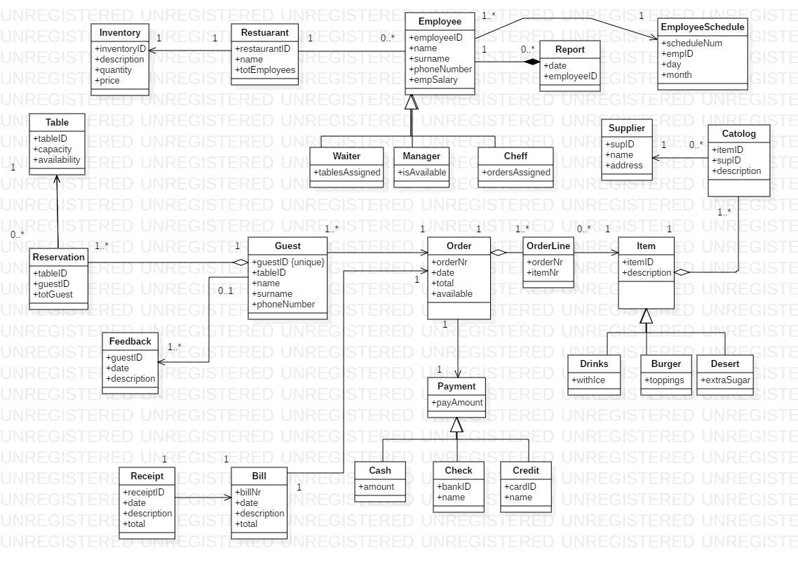

****Restaurant Booking System****

****Problem:****

Non-automated restaurant that make use of pen and paper for when a waiter is placing
orders for customers. The placing of orders takes a great amount of time for waiters 
because of travelling back and forth to the kitchen staff to submit an order. My program 
will effectively record a waiter order so that orders are in a first come, first serve approach 
when delivered to kitchen staff.

****User Requirements****

1. A employee must be able to navigate the system without
    any difficulty.

2. A waiter should be able to place orders according to
    the customer/guest choices.
    
3. A user should be able to make a booking at available times.

4. A customer/guest should get a receipt after completing the
   payment.
   
****Performance Requirements****   

1. The system must process which tables are available or occupied.

2. The system should be able to take any amount of orders and display
   it when its finished.
   
3. The system should be able to calculate the bill and prompt the 
    user for the mode of payment and generate a receipt.  
    
4. The System must pass order to kitchen staff and show the effective status
   order status that are available or still busy.    

5. The System should allow managers to generate a report.

****Order****   
A waiter can take as many orders from the guest.

****Item****   
A order can contain many items and items may have many orders.

****OrderLine****   
This will be the bridging entity in between Order and Item.

****Book****   
A booking can be made by many guest.

****Reservation****
Reservation will act as the bridging entity between Book and Guest

****Guest****
A guest may make many bookings.

****Bill****
A bill will have one order.

****Receipt****
One receipt will be associated with a bill.

